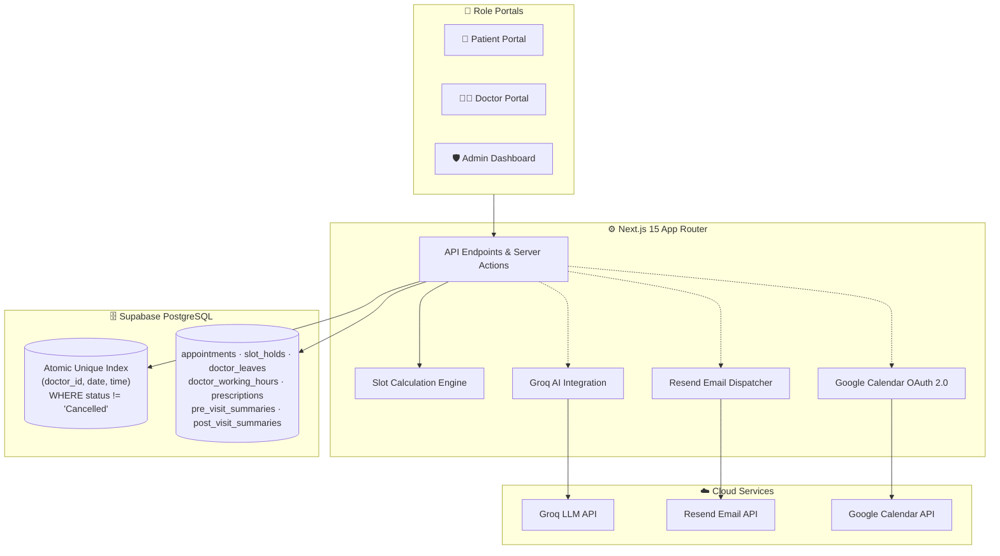

# 🏥 Healthcare Appointment & Follow-up Manager

A full-stack, enterprise-grade medical appointment and follow-up management platform built with **Next.js 15 (App Router)**, **Supabase (PostgreSQL + Auth)**, **Groq AI (qwen/qwen3.6-27b)**, **Resend Email**, and **Google Calendar OAuth 2.0**.

---

## 🌟 Key Features

### 🧑‍⚕️ 1. Patient Portal
- **Doctor Discovery**: Search specialists by medical department, clinical fee, and custom keywords.
- **Real-Time Slot Engine**: View live availability slots calculated dynamically from doctor working shifts, slot duration (15–60 min), and approved doctor leaves.
- **5-Minute Slot Hold**: Temporarily reserve a slot during symptom intake to prevent other users from booking while filling the form.
- **Pre-Visit Symptom Form**: Record chief complaints before booking; automatically analyzed by Groq AI for physician intake triage.
- **Appointment Management**: View upcoming and past consultations with live status badges (`Scheduled`, `Completed`, `Reschedule_Required`, `Cancelled`).
- **Rescheduling & Cancellation**: Self-service atomic rescheduling and cancellation with instant slot release and email updates.
- **Post-Visit Care & Prescription Schedule**: Review patient-friendly explanation, medication frequencies, dosages, duration, and warning signs.
- **Google Calendar Auto-Sync**: One-click Google OAuth connection to keep personal calendars synchronized.

### 👨‍⚕️ 2. Doctor Portal
- **Real-Time Patient Queue**: View upcoming consultations with triage urgency badges (`High`, `Medium`, `Low`).
- **Groq AI Pre-Visit Intake Summary**: Review AI-generated chief complaint and exactly 3 suggested clinical questions tailored to patient symptoms.
- **Clinical Consultation Form**: Record official diagnosis, treatment plan, and clinical examination notes.
- **Structured Prescription Builder**: Add medications with dosage, frequency (e.g. *Twice daily after meals*), duration in days, timing, and special instructions.
- **Groq AI Post-Visit Generator**: Automatically generate empathetic, patient-friendly medical explanations and structured medication schedules.

### 🛡️ 3. Admin Portal
- **Doctor Profiles & Pricing**: Manage doctor specializations, bios, consultation fees, and slot durations.
- **Weekly Working Hours Configuration**: Configure custom shift hours (`09:00 - 17:00`) and availability toggles for each day of the week.
- **Doctor Leave Management**: Schedule doctor leave periods (`start_date` to `end_date`) with **Automated Conflict Resolution**:
  - Automatically identifies all affected active appointments during the leave window.
  - Transitions status to `Reschedule_Required`.
  - Dispatches personalized conflict notification emails to affected patients with priority re-booking links.
- **System-Wide Appointment Audit**: Search, filter, inspect, and manage hospital-wide appointments across all departments.

---

## 🏗️ Technical Architecture & Concurrency Guarantees



### Concurrency & Double-Booking Protection
Double booking prevention is enforced at the **database level** via an atomic PostgreSQL partial unique index:
```sql
CREATE UNIQUE INDEX idx_unique_doctor_slot_active 
ON public.appointments (doctor_id, appointment_date, start_time) 
WHERE status NOT IN ('Cancelled');
```
Any competing concurrent transaction attempting to reserve an identical slot is rejected with PostgreSQL error `23505` (`unique_violation`), returning `HTTP 409 Conflict` to the client.

---

## 🚀 Getting Started

### Prerequisites
- Node.js >= 18
- Supabase Project (PostgreSQL + Auth)
- Groq API Key
- Resend API Key (Optional, graceful fallback included)
- Google Cloud OAuth Credentials (Optional, graceful fallback included)

---

### 1. Clone & Install Dependencies

```bash
git clone https://github.com/Devya29/hospital-management-system.git
cd hospital-management-system
npm install
```

---

### 2. Environment Configuration

Copy the example environment file:
```bash
cp .env.example .env.local
```

Configure the variables in `.env.local`:
```env
# Supabase Configuration
NEXT_PUBLIC_SUPABASE_URL=https://your-project-id.supabase.co
NEXT_PUBLIC_SUPABASE_ANON_KEY=your_supabase_anon_key
NEXT_PUBLIC_SUPABASE_PUBLISHABLE_KEY=your_supabase_anon_key

# Groq LLM API Key (https://console.groq.com/keys)
GROQ_API_KEY=gsk_your_groq_api_key

# Resend Email API Key (https://resend.com/api-keys)
RESEND_API_KEY=re_your_resend_api_key

# Google Calendar OAuth 2.0 Credentials
GOOGLE_CLIENT_ID=your_google_client_id.apps.googleusercontent.com
GOOGLE_CLIENT_SECRET=your_google_client_secret
GOOGLE_REDIRECT_URI=http://localhost:3000/api/auth/google-calendar/callback

# App URL
NEXT_PUBLIC_APP_URL=http://localhost:3000
```

---

### 3. Apply Database Migrations

Run the SQL migration in your Supabase SQL Editor:
- Open `supabase/migrations/20260823_init_healthcare_manager.sql`
- Copy and execute the script in **Supabase Dashboard > SQL Editor**.

The migration sets up:
- `appointments` table with the active slot partial unique index
- `doctor_working_hours` and default seed trigger
- `doctor_leaves`
- `slot_holds`
- `pre_visit_summaries` & `post_visit_summaries`
- `prescriptions` & `prescription_items`
- `medication_reminders`
- `notifications` & `google_calendar_tokens`

---

### 4. Run Development Server

```bash
npm run dev
```

Visit [http://localhost:3000](http://localhost:3000) in your browser.

---

## 🤖 Groq LLM Prompts & Safety Guardrails

### Pre-Visit Intake Prompt
- **System Prompt**: Clinical intake triage assistant.
- **Safety Directive**: **Strictly NON-DIAGNOSTIC**. Does NOT diagnose illness or prescribe medication.
- **Output Schema**:
  ```json
  {
    "urgency": "Low" | "Medium" | "High",
    "chief_complaint": "Summary of primary complaint",
    "suggested_questions": [
      "Question 1?",
      "Question 2?",
      "Question 3?"
    ]
  }
  ```

### Post-Visit Summary Prompt
- **Input**: Doctor's clinical notes, diagnosis, and prescription items.
- **Output**: Patient-friendly explanation, structured medication timing, and actionable follow-up instructions.

---

## 📡 REST API Documentation

| Method | Endpoint | Description |
|---|---|---|
| `GET` | `/api/doctors` | List doctors with specialization and search filters |
| `GET` | `/api/doctors/:id/availability?date=YYYY-MM-DD` | Calculate dynamic slot availability |
| `POST` | `/api/appointments/hold` | Hold a slot for 5 minutes during intake |
| `DELETE` | `/api/appointments/hold?token=...` | Release an active slot hold |
| `POST` | `/api/appointments/book` | Concurrency-safe appointment booking |
| `GET` | `/api/appointments` | List appointments for patient/doctor/admin |
| `POST` | `/api/appointments/:id/cancel` | Cancel appointment and release slot |
| `POST` | `/api/appointments/:id/reschedule` | Reschedule appointment to a new slot |
| `POST` | `/api/doctor/appointments/:id/complete` | Submit clinical notes & generate AI summary |
| `POST` | `/api/ai/post-visit` | Generate/regenerate post-visit AI summary |
| `GET` | `/api/admin/leaves` | List doctor leave records |
| `POST` | `/api/admin/leaves` | Schedule doctor leave & resolve conflicts |
| `DELETE` | `/api/admin/leaves?id=...` | Cancel doctor leave |
| `GET/POST` | `/api/admin/doctor-schedule` | Manage doctor working shifts & slot duration |
| `GET` | `/api/cron/reminders` | Dispatch 24h & 2h email reminders |
| `GET` | `/api/cron/medication-reminders` | Dispatch daily medication reminders |
| `GET` | `/api/cron/retry-notifications` | Retry failed email notifications |

---

## 🧪 Verification & Testing Instructions

1. **Test Concurrency Double-Booking**:
   - Open two browser tabs on the booking page for the same doctor and date.
   - Attempt to book the identical slot in both tabs simultaneously.
   - Observe that the first succeeds and the second returns `409 Conflict: This slot was just booked by another user`.

2. **Test Doctor Leave Conflict Handling**:
   - In Admin Portal (`/admin`), create a doctor leave for tomorrow.
   - Observe any existing appointment for that doctor tomorrow is automatically moved to `Reschedule_Required` and the patient receives a conflict notification email.
   - Check the patient portal (`/patient`) to confirm the appointment indicates `Reschedule Needed` and allows 1-click rebooking.

3. **Test Groq AI Intake & Post-Visit**:
   - Book an appointment with symptoms (`"Severe headache and fever for 2 days"`).
   - In Doctor Portal (`/doctor`), see the AI Pre-visit summary badge and 3 suggested questions.
   - Complete visit with diagnosis and medications, then inspect the patient portal to see the generated patient-friendly summary and medication schedule.

4. **Run Automated Code Quality Checks**:
   ```bash
   npm run build
   npm run lint
   ```
