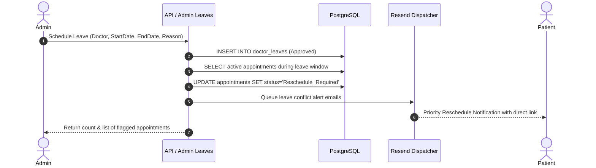
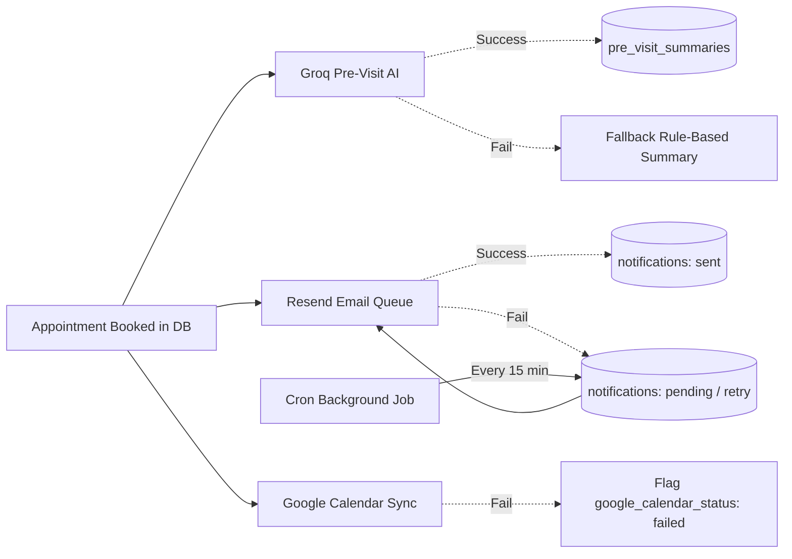

# System Design: Healthcare Appointment & Follow-up Manager

This document details the core architectural mechanisms powering concurrency control, conflict resolution, slot reservation, and failure resilience in the Healthcare Appointment & Follow-up Manager.

---

## 1. Double-Booking Prevention (Database-Level Guarantee)

### The Challenge
Frontend availability validation and sequential API checks are vulnerable to race conditions when multiple patients attempt to book the identical doctor slot concurrently.

### Architecture & Implementation
1. **Atomic Postgres Partial Unique Index**:
   Concurrency protection is enforced in PostgreSQL at the schema level:
   ```sql
   CREATE UNIQUE INDEX idx_unique_doctor_slot_active 
   ON public.appointments (doctor_id, appointment_date, start_time) 
   WHERE status NOT IN ('Cancelled');
   ```
2. **Transaction Isolation**:
   When concurrent `INSERT` or `UPDATE` transactions execute, PostgreSQL serializes index insertion. Only the first transaction commits; any competing transaction fails with constraint violation code `23505` (`unique_violation`).
3. **Application Handling**:
   The API catches error `23505`, rolls back gracefully, and returns an immediate `HTTP 409 Conflict` with a user-friendly message (`DOUBLE_BOOKING_PREVENTED`), instructing the client to select another slot without corrupting system state.

---

## 2. Doctor Leave Conflict Handling

### The Challenge
When a doctor is granted leave, existing scheduled appointments within the leave window must not be silently deleted or left in an ambiguous state.

### Architecture & Resolution Flow


1. **State Preservation**: Impacted appointments are transitioned to `status = 'Reschedule_Required'`. This retains complete intake symptoms, doctor linkage, and audit history.
2. **Availability Blocking**: The slot generation engine cross-references `doctor_leaves` and blocks new slot generation for all dates within `[start_date, end_date]`.
3. **Asynchronous Notification**: The system queues personalized email notifications via Resend with direct portal links, giving affected patients priority re-booking.

---

## 3. Slot Hold Mechanism

### The Challenge
Patients need sufficient time (e.g., 5 minutes) to fill out symptom descriptions and review consultation fees without losing their slot, but abandoned checkouts must not permanently lock slots.

### Architecture
1. **Hold Table & Expiration Timestamp**:
   ```sql
   CREATE TABLE public.slot_holds (
       id SERIAL PRIMARY KEY,
       doctor_id INT NOT NULL,
       slot_date DATE NOT NULL,
       start_time TIME NOT NULL,
       end_time TIME NOT NULL,
       hold_token VARCHAR(100) UNIQUE,
       patient_id INT,
       expires_at TIMESTAMPTZ NOT NULL
   );
   ```
2. **Time-To-Live (TTL)**: Holds are created with `expires_at = NOW() + INTERVAL '5 minutes'`.
3. **Slot Engine Integration**: Slot availability queries check:
   ```sql
   WHERE expires_at > NOW()
   ```
   Expired holds are automatically disregarded by slot generation queries without requiring eager table cleanup.
4. **Lifecycle Hooks**:
   - **Booking Confirmed**: Hold is deleted immediately upon successful appointment creation.
   - **Modal Dismissed**: Client triggers `DELETE /api/appointments/hold?token=...` to release the slot immediately.

---

## 4. Third-Party Failure & Retry Handling

### The Challenge
Outages or rate limits in external services (Groq LLM, Resend Email, Google Calendar API) must NEVER cause appointment booking transactions to roll back or crash the application.



1. **Transaction Decoupling**: Database booking is the single source of truth and commits first. AI, Email, and Calendar sync run asynchronously in isolated `try/catch` blocks.
2. **Groq AI Graceful Degradation**:
   If Groq fails or times out (12s threshold), the system creates a safe rule-based triage record (`Medium` urgency, standard clinical questions, `status: 'completed'`), ensuring uninterrupted doctor review.
3. **Resend Email Queue & Cron Retries**:
   Failed email sends are logged to `notifications` with `status: 'failed'` and `retry_count`. A cron endpoint (`/api/cron/retry-notifications`) retries dispatch up to 3 times with exponential backoff.
4. **Google Calendar Event Recovery**:
   If OAuth token refresh fails or Calendar API errors out, the appointment records `google_calendar_status = 'failed'`, enabling non-blocking background recovery.
